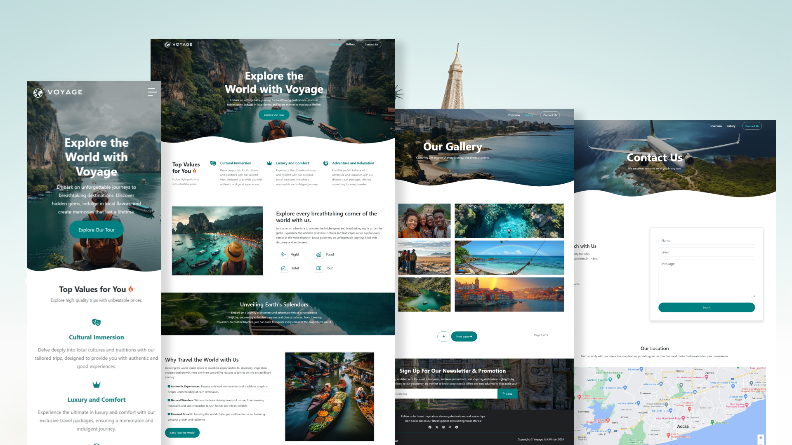

# Voyage Landing Page

## About

This is a sleek and responsive landing page for a travel and tour website, designed to captivate users and offer them an engaging experience. Built with HTML, SCSS, JavaScript, and Bootstrap, the landing page features a modern design.

## Demo

 <!-- Replace with your image path -->

## Technologies Used

- **HTML**: Structure of the webpage.
- **SCSS**: For advanced styling and organization.
- **JavaScript**: For dynamic interactions and functionality.
- **Bootstrap**: For responsive design and layout.

## License

MIT

## Contact

Akua Adomako Mintah - [marymintah32@gmail.com](marymintah32@gmail.com)

Project Link: [Voyage](https://voyagett.netlify.app/)
